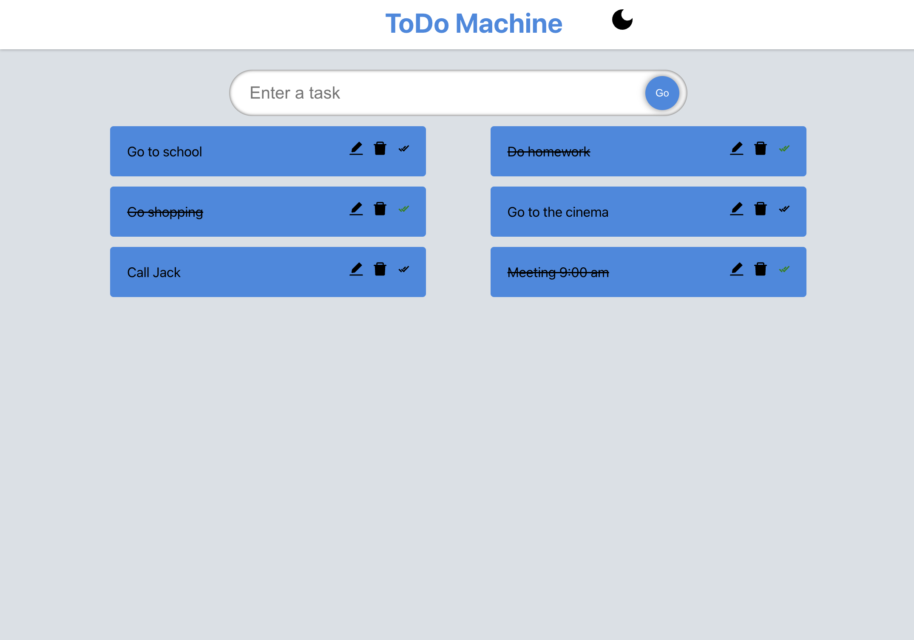
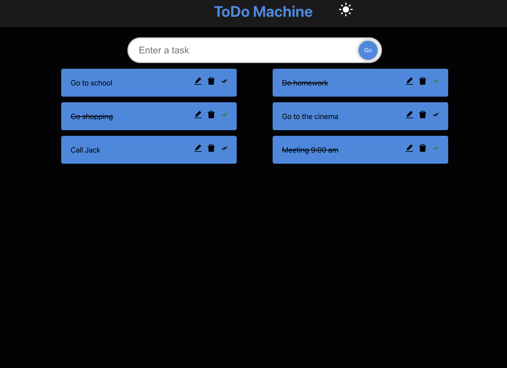

# TodoMachine

                                Description

A React js web application that helps students to create a to do list for daily tasks.
• Used local storage web browser that helps us store information and keep it active for a long time.
• Implemented a custom hook to improve the state management.

 
 

                            
